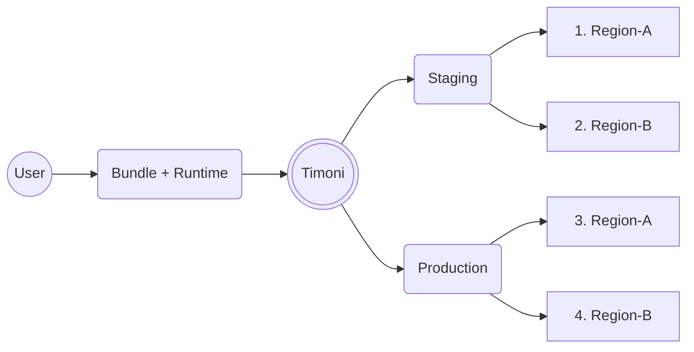

# Multi-cluster Deployments

Timoni offers a declarative way of managing the delivery of applications across environments.
The Timoni [Runtime](bundle-runtime.md) allows defining groups of clusters where apps are being deployed.
The Timoni [Bundle](bundle.md) supports customising the apps configuration based on the target
environment (group of clusters) and even for a specific cluster in a group.



When applying a Bundle to multiple clusters, Timoni iterates over the clusters
in the order defined in the Runtime definition.
It connects to each cluster, deploys the app changes, runs health checks,
and end-to-end tests before moving to the next cluster.

## Multi-clusters definitions

### Runtime definition

The following is an example of a Runtime definition containing a list of clusters:

```cue
runtime: {
	apiVersion: "v1alpha1"
	name:       "fleet"
	clusters: {
		"preview-eu-1": {
			group:       "staging"
			kubeContext: "eks-eu-west-2"
		}
		"preview-us-1": {
			group:       "staging"
			kubeContext: "eks-us-west-2"
		}
		"prod-eu-1": {
			group:       "production"
			kubeContext: "eks-eu-west-1"
		}
		"prod-us-1": {
			group:       "production"
			kubeContext: "eks-us-west-1"
		}
	}
	values: [
		{
			query: "k8s:v1:Namespace:default"
			for: {
				"CLUSTER_UID": "obj.metadata.uid"
			}
		},
	]
}
```

A cluster entry is composed of:

- The name of the cluster, used to unique identify a Kubernetes cluster.
- The group, used to denote the environment a cluster belongs to.
- The kubeContext, used to select a context from the kubeconfig file.

!!! tip "kubeconfig"

    Note that all clusters defined in the Runtime file must have a
    corresponding context in the kubeconfig file.
    By default, Timoni looks for a file named `config` in the `$HOME/.kube` directory.
    You can specify other kubeconfig file by setting the `KUBECONFIG` environment
    variable or by setting the `--kubeconfig` flag.

The `values` list can be used to query each cluster to extract values needed to
configure Ingress, TLS, auth, etc, during the app deployment. For more information
on how to query a cluster, please see the [runtime values doc](bundle-runtime.md#values).

### Bundle definition

The following is an example of a Bundle definition that uses the cluster attributes
to set the number of replicas to different values for staging and production:

```cue
bundle: {
	_cluster: {
		name:  string @timoni(runtime:string:TIMONI_CLUSTER_NAME)
		group: string @timoni(runtime:string:TIMONI_CLUSTER_GROUP)
		uid:   string @timoni(runtime:string:CLUSTER_UID)
	}

	apiVersion: "v1alpha1"
	name:       "apps"
	instances: {
		podinfo: {
			module: url: "oci://ghcr.io/stefanprodan/modules/podinfo"
			namespace: "apps"
			values: {
				ui: message: "Hosted by \(_cluster.name) id \(_cluster.uid)"
				if _cluster.group == "staging" {
					replicas: 1
				}
				if _cluster.group == "production" {
					replicas: 2
				}
			}
		}
	}
}

```

The cluster name and group, are mapped to fields in a Bundle using the following attributes:

- `@timoni(runtime:string:TIMONI_CLUSTER_NAME)`
- `@timoni(runtime:string:TIMONI_CLUSTER_GROUP)`

## Multi-cluster operations

### Validation

Build the Runtime definition to verify the connectivity to each cluster:

=== "command"

    ```shell
    timoni runtime build -f runtime.cue
    ```

=== "output"

    ```text
    r:fleet > c:preview-eu-1 > CLUSTER_UID: bc83fc97-3cb9-42ca-ae38-cc09501e01e3
    r:fleet > c:prod-eu-1 > CLUSTER_UID: 61fad037-bc8a-420e-a7b2-1d72fdc17e61
    ```

Print the Bundle variants to verify the final values used for each cluster:

=== "command"

    ```shell
    timoni bundle vet --print-value -f bundle.cue -r runtime.cue
    ```

=== "output"

    ```cue
    "preview-eu-1": bundle: {
        apiVersion: "v1alpha1"
        name:       "apps"
        instances: {
            podinfo: {
                module: {
                    url:     "oci://ghcr.io/stefanprodan/modules/podinfo"
                    version: *"latest" | string
                }
                namespace: "apps"
                values: {
                    test: {
                        enabled: true
                    }
                    replicas: 1
                    ui: {
                        message: "Hosted by preview-eu-1 id bc83fc97-3cb9-42ca-ae38-cc09501e01e3"
                    }
                }
            }
        }
    }
    "prod-eu-1": bundle: {
        apiVersion: "v1alpha1"
        name:       "apps"
        instances: {
            podinfo: {
                module: {
                    url:     "oci://ghcr.io/stefanprodan/modules/podinfo"
                    version: *"latest" | string
                }
                namespace: "apps"
                values: {
                    test: {
                        enabled: true
                    }
                    replicas: 2
                    ui: {
                        message: "Hosted by prod-eu-1 id 61fad037-bc8a-420e-a7b2-1d72fdc17e61"
                    }
                }
            }
        }
    }
    ```

Perform a dry-run apply of the Bundle to review the changes across clusters:

=== "command"

    ```shell
    timoni bundle apply --dry-run -f bundle.cue -r runtime.cue
    ```

=== "output"

    ```text
    b:apps > c:preview-eu-1 > applying 1 instance(s) on staging (server dry run)
    b:apps > c:preview-eu-1 > i:podinfo > applying module timoni.sh/podinfo version 6.5.3
    b:apps > c:preview-eu-1 > i:podinfo > Namespace/apps created (server dry run)
    b:apps > c:preview-eu-1 > i:podinfo > ServiceAccount/apps/podinfo created (server dry run)
    b:apps > c:preview-eu-1 > i:podinfo > Service/apps/podinfo created (server dry run)
    b:apps > c:preview-eu-1 > i:podinfo > Deployment/apps/podinfo created (server dry run)
    b:apps > c:preview-eu-1 > i:podinfo > Job/apps/podinfo-test created (server dry run)
    b:apps > c:preview-eu-1 > i:podinfo > applied successfully (server dry run)
    b:apps > c:preview-eu-1 > applied successfully (server dry run)
    b:apps > c:prod-eu-1 > applying 1 instance(s) on production (server dry run)
    b:apps > c:prod-eu-1 > i:podinfo > applying module timoni.sh/podinfo version 6.5.3
    b:apps > c:prod-eu-1 > i:podinfo > Namespace/apps created (server dry run)
    b:apps > c:prod-eu-1 > i:podinfo > ServiceAccount/apps/podinfo created (server dry run)
    b:apps > c:prod-eu-1 > i:podinfo > Service/apps/podinfo created (server dry run)
    b:apps > c:prod-eu-1 > i:podinfo > Deployment/apps/podinfo created (server dry run)
    b:apps > c:prod-eu-1 > i:podinfo > Job/apps/podinfo-test created (server dry run)
    b:apps > c:prod-eu-1 > i:podinfo > applied successfully (server dry run)
    b:apps > c:prod-eu-1 > applied successfully (server dry run)
    ```

### Install and Upgrade

To install or upgrade the instances defined in the Bundle to all clusters:

=== "command"

    ```shell
    timoni bundle apply -f bundle.cue -r runtime.cue
    ```

=== "output"
    
    ```text
    b:apps > c:preview-eu-1 > applying 1 instance(s) on staging
    b:apps > c:preview-eu-1 > i:podinfo > applying module timoni.sh/podinfo version 6.5.3
    b:apps > c:preview-eu-1 > i:podinfo > installing podinfo in namespace apps
    b:apps > c:preview-eu-1 > i:podinfo > Namespace/apps created
    b:apps > c:preview-eu-1 > i:podinfo > applying app
    b:apps > c:preview-eu-1 > i:podinfo > ServiceAccount/apps/podinfo created
    b:apps > c:preview-eu-1 > i:podinfo > Service/apps/podinfo created
    b:apps > c:preview-eu-1 > i:podinfo > Deployment/apps/podinfo created
    b:apps > c:preview-eu-1 > i:podinfo > app resources ready
    b:apps > c:preview-eu-1 > i:podinfo > applying test
    b:apps > c:preview-eu-1 > i:podinfo > Job/apps/podinfo-test created
    b:apps > c:preview-eu-1 > i:podinfo > test resources ready
    b:apps > c:preview-eu-1 > applied successfully in 22s
    b:apps > c:prod-eu-1 > applying 1 instance(s) on production
    b:apps > c:prod-eu-1 > i:podinfo > applying module timoni.sh/podinfo version 6.5.3
    b:apps > c:prod-eu-1 > i:podinfo > installing podinfo in namespace apps
    b:apps > c:prod-eu-1 > i:podinfo > Namespace/apps created
    b:apps > c:prod-eu-1 > i:podinfo > applying app
    b:apps > c:prod-eu-1 > i:podinfo > ServiceAccount/apps/podinfo created
    b:apps > c:prod-eu-1 > i:podinfo > Service/apps/podinfo created
    b:apps > c:prod-eu-1 > i:podinfo > Deployment/apps/podinfo created
    b:apps > c:prod-eu-1 > i:podinfo > app resources ready
    b:apps > c:prod-eu-1 > i:podinfo > applying test
    b:apps > c:prod-eu-1 > i:podinfo > Job/apps/podinfo-test created
    b:apps > c:prod-eu-1 > i:podinfo > test resources ready
    b:apps > c:prod-eu-1 > applied successfully in 44s
    ```

Note that Timoni deploys the app instances to all the clusters, in the order
defined in the Runtime. If the apply fails on a staging cluster,
Timoni will stop the execution and not continue with production.

After editing a bundle file, to review the changes that will
be made on all clusters:

```shell
timoni bundle apply -f bundle.cue -r runtime.cue --dry-run --diff
```

### Status

To list the current status of the deployed apps on all clusters:

=== "command"
    
    ```shell
    timoni bundle status -f bundle.cue -r runtime.cue
    ```

=== "output"

    ```text
    b:apps > c:preview-eu-1 > i:podinfo > last applied 2023-11-25T12:50:02Z
    b:apps > c:preview-eu-1 > i:podinfo > module oci://ghcr.io/stefanprodan/modules/podinfo:6.5.3
    b:apps > c:preview-eu-1 > i:podinfo > digest sha256:54d38b407012ccfb42badf0974ba70f9ae229ecd38f17e8a1f4e7189283b924f
    b:apps > c:preview-eu-1 > i:podinfo > container image ghcr.io/curl/curl-container/curl-multi:master
    b:apps > c:preview-eu-1 > i:podinfo > container image ghcr.io/stefanprodan/podinfo:6.5.3
    b:apps > c:preview-eu-1 > i:podinfo > ServiceAccount/apps/podinfo Current - Resource is current
    b:apps > c:preview-eu-1 > i:podinfo > Service/apps/podinfo Current - Service is ready
    b:apps > c:preview-eu-1 > i:podinfo > Deployment/apps/podinfo Current - Deployment is available. Replicas: 1
    b:apps > c:preview-eu-1 > i:podinfo > Job/apps/podinfo-test Current - Job Completed. succeeded: 1/1
    b:apps > c:prod-eu-1 > i:podinfo > last applied 2023-11-25T12:50:24Z
    b:apps > c:prod-eu-1 > i:podinfo > module oci://ghcr.io/stefanprodan/modules/podinfo:6.5.3
    b:apps > c:prod-eu-1 > i:podinfo > digest sha256:54d38b407012ccfb42badf0974ba70f9ae229ecd38f17e8a1f4e7189283b924f
    b:apps > c:prod-eu-1 > i:podinfo > container image ghcr.io/curl/curl-container/curl-multi:master
    b:apps > c:prod-eu-1 > i:podinfo > container image ghcr.io/stefanprodan/podinfo:6.5.3
    b:apps > c:prod-eu-1 > i:podinfo > ServiceAccount/apps/podinfo Current - Resource is current
    b:apps > c:prod-eu-1 > i:podinfo > Service/apps/podinfo Current - Service is ready
    b:apps > c:prod-eu-1 > i:podinfo > Deployment/apps/podinfo Current - Deployment is available. Replicas: 2
    b:apps > c:prod-eu-1 > i:podinfo > Job/apps/podinfo-test Current - Job Completed. succeeded: 1/1
    ```

Or using the bundle name:

```shell
timoni bundle status my-bundle -r runtime.cue
```

### Uninstall

To delete all deployed apps on all clusters:

=== "command"
    
    ```shell
    timoni bundle delete -f bundle.cue -r runtime.cue
    ```

=== "output"
    
    ```text
    b:apps > c:preview-eu-1 > deleting instance podinfo in namespace apps
    b:apps > c:preview-eu-1 > Job/apps/podinfo-test deleted
    b:apps > c:preview-eu-1 > Deployment/apps/podinfo deleted
    b:apps > c:preview-eu-1 > Service/apps/podinfo deleted
    b:apps > c:preview-eu-1 > ServiceAccount/apps/podinfo deleted
    b:apps > c:preview-eu-1 > all resources have been deleted
    b:apps > c:prod-eu-1 > deleting instance podinfo in namespace apps
    b:apps > c:prod-eu-1 > Job/apps/podinfo-test deleted
    b:apps > c:prod-eu-1 > Deployment/apps/podinfo deleted
    b:apps > c:prod-eu-1 > Service/apps/podinfo deleted
    b:apps > c:prod-eu-1 > ServiceAccount/apps/podinfo deleted
    b:apps > c:prod-eu-1 > all resources have been deleted
    ```

Or using the bundle name:

```shell
timoni bundle delete my-bundle -r runtime.cue
```

### Cluster filtering

To perform an apply only on a group of clusters:

```shell
timoni bundle apply -f bundle.cue -r runtime.cue --runtime-group staging
```

To perform an apply only on a cluster:

```shell
timoni bundle apply -f bundle.cue -r runtime.cue --runtime-cluster prod-eu-1
```

Note that all `timoni bundle` commands support filtering by cluster name and group.
