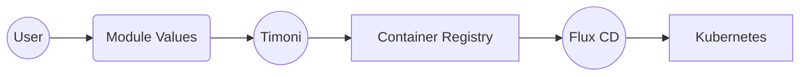

# GitOps Guide

This guide shows you how Timoni can be used together with
[Flux](https://fluxcd.io) to create a GitOps delivery pipeline
for module instances.



## Build and Push workflow

We'll build a module instance with Timoni, and we'll push 
the resulting Kubernetes manifests to a container registry with Flux CLI.

```shell
timoni -n apps build podinfo oci://ghcr.io/stefanprodan/modules/podinfo \
  --values ./staging-values.cue | \
flux push artifact oci://registry.internal/podinfo:staging \
  --source="http://github.com/stefanprodan/podinfo" \
  --revision="6.3.4" \
  --path=-
```

The above commands could be run in CI for the Git repository
that contains the values files. Committing a change to the values, will
result in a new artifact pushed to the registry. From there, Flux running
in Kubernetes, will pick up the latest changes and deploy them on the cluster.

## Continuous Delivery workflow

In the Git repository where Flux was bootstrap, we'll configure the reconciliation
of the Kubernetes resources pushed to the container registry.

```yaml
---
apiVersion: source.toolkit.fluxcd.io/v1beta2
kind: OCIRepository
metadata:
  name: podinfo
  namespace: flux-system
spec:
  interval: 1m
  url: oci://registry.internal/podinfo
  ref:
    tag: staging
---
apiVersion: kustomize.toolkit.fluxcd.io/v1beta2
kind: Kustomization
metadata:
  name: podinfo
  namespace: flux-system
spec:
  targetNamespace: apps
  interval: 1h
  retryInterval: 30s
  timeout: 5m
  path: ./
  prune: true
  wait: true
  sourceRef:
    kind: OCIRepository
    name: podinfo
```

Based on the above configuration, Flux will look for changes in the container registry every minute.
When it finds a new digest of the OCI artifact, Flux will automatically reconcile the changes on the cluster.

To find out more about Flux OCI support please see the [Flux OCI docs](https://fluxcd.io/flux/cheatsheets/oci-artifacts/).
